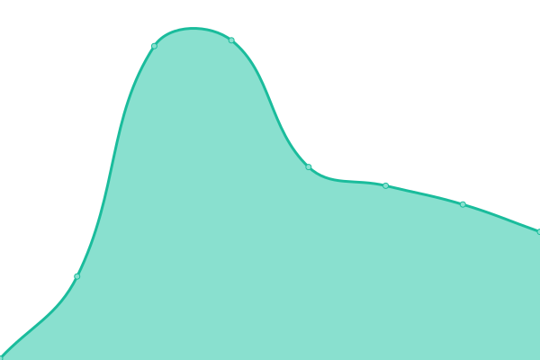

# [📈 Live Status](https://future-lab.uk): <!--live status--> **🟩 All systems operational**

We use [Issues](https://github.com/daniel-law/future-lab-status/issues) as incident reports, [Actions](https://github.com/daniel-law/future-lab-status/actions) as uptime monitors, and [Pages](https://future-lab.uk) for the Future Lab status page.

<!--start: status pages-->
<!-- This summary is generated by Upptime (https://github.com/upptime/upptime) -->
<!-- Do not edit this manually, your changes will be overwritten -->
<!-- prettier-ignore -->
| URL | Status | History | Response Time | Uptime |
| --- | ------ | ------- | ------------- | ------ |
|  [Portfolio](https://daniellaw.me) | 🟩 Up | [portfolio.yml](https://github.com/daniel-law/future-lab-status/commits/HEAD/history/portfolio.yml) | 

 137ms
     
 | 

<a href="https://future-lab.uk/history/portfolio">100.00%</a>
    

|  [Frugality](https://frugality.app) | 🟩 Up | [frugality.yml](https://github.com/daniel-law/future-lab-status/commits/HEAD/history/frugality.yml) | 

 445ms
     
 | 

<a href="https://future-lab.uk/history/frugality">100.00%</a>
    

|  [Kurisu](https://kurisu.future-lab.uk) | 🟩 Up | [kurisu.yml](https://github.com/daniel-law/future-lab-status/commits/HEAD/history/kurisu.yml) | 

 287ms
     
 | 

<a href="https://future-lab.uk/history/kurisu">100.00%</a>
    

<!--end: status pages-->

[**Visit the Future Lab status site →**](https://future-lab.uk)

## 📄 License

- Powered by: [Upptime](https://github.com/upptime/upptime)
- Code: [MIT](./LICENSE) © [Anand Chowdhary](https://anandchowdhary.com)
- Data in the `./history` directory: [Open Database License](https://opendatacommons.org/licenses/odbl/1-0/)
